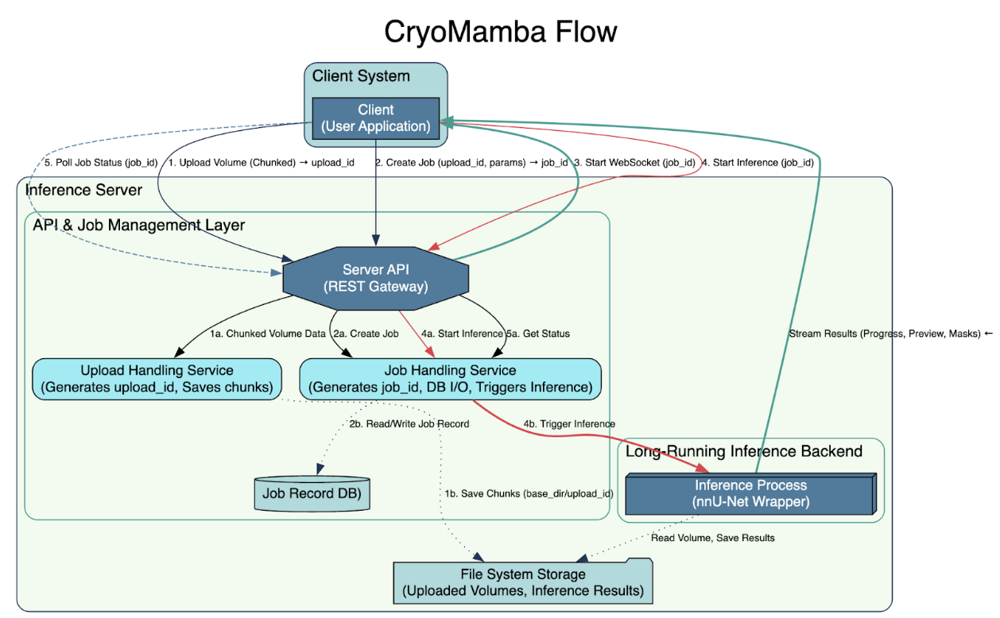

# CryoMamba

A comprehensive system for cryo-electron tomography (cryo-ET) volume segmentation combining a GPU inference server with an interactive desktop visualization client.

## Overview

CryoMamba provides:
- **GPU Inference Server**: FastAPI-based server running nnU-Net v2 for high-performance 3D segmentation
- **Desktop Client**: napari-based visualization application for macOS with real-time preview streaming
- **Chunked Upload System**: Efficient handling of large cryo-ET volumes (up to 10+ GB)
- **WebSocket Streaming**: Real-time preview updates during inference
- **Export Capabilities**: Multiple export formats with metadata preservation

## Quick Start

Before you install, please make sure you have Python 3.10 or above installed as it's required by nnU-Net.
Run `python3 --version` to check the version.
Run `brew install python@3.x` (x >= 10) to install if necessary.

Run the following commands:

```bash
# 1. Create a clean virtual environment
python3 -m venv cryomamba-env
source cryomamba-env/bin/activate

# 2. Upgrade core build tools
pip install --upgrade pip setuptools wheel

#
# Run steps 3-8 to set up nnU-Net but you may skip them if you already have nnU-Net installed.
#

# 3. Clone batchgeneratorsv2
git clone https://github.com/MIC-DKFZ/batchgeneratorsv2.git
cd batchgeneratorsv2

# 4. Install in editable mode
pip install -e .

# 5. Clone nnU-Net
cd ..
git clone https://github.com/MIC-DKFZ/nnUNet.git
cd nnUNet

# 6. Install in editable mode
pip install -e .

# 7. Set up nnU-Net environment variables (required for nnU-Net to work) 
# Add the following to cryomamba-env/bin/activate to ensure environment variables are set every time you activate your virtual environment
export NNUNET_MODEL_DIR="/path/to/pretrained_weights"
export NNUNET_DEVICE="cpu"   # Use "cuda" if you have GPU
export nnUNet_raw="/path/to/nnUNet_raw"
export nnUNet_preprocessed="/path/to/nnUNet_preprocessed" 
export nnUNet_results="/path/to/nnUNet_results"

# 8. Create directories
mkdir -p "$nnUNet_raw" "$nnUNet_preprocessed" "$nnUNet_results"
cd..

# 9. Clone CryoMamba
git clone https://github.com/ebeetles/CryoMamba.git

# 10. Install server dependencies
cd CryoMamba
pip install -r requirements.txt

# 11. Navigate to client directory and install client dependencies
cd napari_cryomamba
(fix licence in pyproject.toml, fix requirement.txt)
pip install -r requirements.txt
```

To start the server, open a new terminal and run the following commands:

```bash
# 1. Activate the virtual environment
source cryomamba-env/bin/activate 

# 2. Start the server
cd CryoMamba
python -m uvicorn app.main:app --host 0.0.0.0 --port 8000    # specify your own host and port
```

(The server will be available at http://localhost:8000. Check health at http://localhost:8000/v1/healthz.)

To start the client, open a new terminal and run the following commands:

```bash
# 1. Activate the virtual environment
source cryomamba-env/bin/activate 

# Launch desktop application
cd CryoMamba/napari_cryomamba
python main.py
```

#### Step 3: Run Your First Segmentation (5 minutes)

```bash
# Launch desktop application
python main.py
```

1. **Configure Server**: Enter server URL (e.g., `http://localhost:8000`)
2. **Load Volume**: Click "Open .mrc File" and select a test volume from `test_data/`
3. **Start Segmentation**: Click "Run Segmentation"
4. **Watch Progress**: Real-time previews appear as inference progresses
5. **Export Results**: Use "Export" menu to save segmentation mask

✅ **Success!** You've completed your first cryo-ET segmentation with CryoMamba.

---

## System Requirements

### GPU Inference Server

| Component | Minimum (CPU-only) | Recommended (GPU) |
|-----------|---------|-------------|
| GPU | **Not required** (can run on CPU) | 24-48 GB VRAM (NVIDIA A6000/A100) |
| RAM | 16 GB | 64 GB (CPU-only) / 128 GB (GPU) |
| Storage | 100 GB | 1 TB NVMe (CPU) / 2 TB NVMe RAID (GPU) |
| OS | Ubuntu 20.04+ / macOS | Ubuntu 22.04 LTS |
| CUDA | Not required | 11.8+ (for GPU mode) |
| Python | 3.9+ | 3.10 |

**Performance Notes:**
- **CPU-only mode**: Works for development/testing but inference is 10-50× slower
- **GPU mode**: Required for production use with large volumes or time-sensitive work
- **Your current setup**: Running on CPU (perfectly fine for testing!)

### Desktop Client

**Note**: Desktop client does NOT require a GPU - visualization runs on CPU only.

| Component | Minimum | Recommended |
|-----------|---------|-------------|
| OS | macOS 12 (Monterey) | macOS 13+ (Ventura/Sonoma) |
| RAM | 16 GB | 32 GB |
| Storage | 100 GB free | 500 GB free |
| Display | 1920×1080 | 2560×1440+ (Retina) |
| Python | 3.8+ | 3.10 |
| GPU | **Not required** | Integrated graphics sufficient |

---

## Installation

### GPU Server Installation

#### Option 1: Standard Installation

```bash
# Clone repository
git clone <repository-url>
cd CryoMamba

# Create virtual environment
python3 -m venv venv
source venv/bin/activate

# Install dependencies (core dependencies only)
pip install -r requirements.txt

# Install nnU-Net v2 (separate step due to build complexity)
pip install nnunetv2

# Set up nnU-Net environment variables (required for nnU-Net to work)
export nnUNet_raw="/path/to/nnUNet_raw"
export nnUNet_preprocessed="/path/to/nnUNet_preprocessed" 
export nnUNet_results="/path/to/nnUNet_results"

# Create directories (run from anywhere after setting variables)
mkdir -p "$nnUNet_raw" "$nnUNet_preprocessed" "$nnUNet_results"

# Download pretrained weights
mkdir -p pretrained_weights
# Copy your nnU-Net trained model to pretrained_weights/
```

#### Option 2: Docker Installation

```bash
# Build Docker image
docker-compose build

# Start server
docker-compose up -d

# Check logs
docker-compose logs -f
```

#### Configuration (Optional)

The server works with defaults, but you can customize with environment variables:

```bash
# Optional: Create .env file in project root
# nnU-Net configuration
NNUNET_MODEL_DIR=/path/to/pretrained_weights  # Default: uses your current path
NNUNET_DEVICE=cpu  # Default: "cuda" (use "cpu" if no GPU)

# Server configuration  
HOST=0.0.0.0  # Default: 0.0.0.0
PORT=8000     # Default: 8000
DEBUG=false   # Default: false

# Upload settings
UPLOAD_BASE_DIR=/tmp/cryomamba_uploads  # Default: /tmp/cryomamba_uploads
MAX_UPLOAD_SIZE_GB=20  # Default: 20 GB

# GPU configuration (if using GPU)
CUDA_VISIBLE_DEVICES=0
PYTORCH_CUDA_ALLOC_CONF=max_split_size_mb:512
```

**Note**: All environment variables are optional - the server will work with sensible defaults!

### Pretrained Weights

**IMPORTANT**: CryoMamba requires pretrained nnU-Net weights for inference. These are **NOT included** in the repository due to size (~500MB).

#### Option 1: Use Pre-trained Weights (Recommended)

Download pre-trained weights for cryo-ET segmentation:

```bash
# Create directory for weights
mkdir -p pretrained_weights

# Download pre-trained weights (example - replace with actual source)
# Contact the CryoMamba team for access to pre-trained weights
# or train your own using nnU-Net v2
```

#### Option 2: Train Your Own Model

If you have labeled cryo-ET data:

```bash
# Install nnU-Net training dependencies
pip install nnunetv2[training]

# Follow nnU-Net v2 training documentation
# https://github.com/MIC-DKFZ/nnUNet/blob/master/documentation/training_example.md
```

#### Option 3: Use Public Datasets

Train on publicly available cryo-ET datasets:
- **EMPIAR**: https://www.ebi.ac.uk/empiar/
- **EMDB**: https://www.ebi.ac.uk/emdb/

#### Configuration

Set the path to your pretrained weights:

```bash
# Set environment variable
export NNUNET_MODEL_DIR="/path/to/your/pretrained_weights"

# Or update the default path in app/config.py
```

**Note**: Without pretrained weights, the server will start but inference jobs will fail.

### Desktop Client Installation

#### Development Installation

```bash
# Install desktop client dependencies (from project root)
pip install -r napari_cryomamba/requirements.txt

# Navigate to desktop client directory
cd napari_cryomamba

# Install the package (simple and reliable)
pip install .

# Verify installation
python -c "import napari_cryomamba; print('Installation successful!')"
```

**For development (editable install):**
If you want to edit code and see changes immediately:
```bash
# Upgrade pip (required for pyproject.toml editable installs)
pip install --upgrade pip

# Install in editable mode
pip install -e .
```

#### Production Installation (macOS App)

Download the latest `.dmg` installer from the releases page:

1. Download `CryoMamba-<version>.dmg`
2. Open the DMG file
3. Drag CryoMamba.app to Applications folder
4. Launch from Applications

**Note**: First launch may require right-click → Open due to macOS Gatekeeper.

---

## Usage

### GPU Server Usage

#### Starting the Server

```bash
# Development mode (with auto-reload)
python dev.py

# Production mode
python -m uvicorn app.main:app --host 0.0.0.0 --port 8000 --workers 4

# With HTTPS (recommended for production)
python -m uvicorn app.main:app --host 0.0.0.0 --port 8443 \
  --ssl-keyfile /path/to/key.pem --ssl-certfile /path/to/cert.pem
```

#### Server Management

```bash
# Check server health
curl http://localhost:8000/v1/healthz

# Get server info
curl http://localhost:8000/v1/server/info

# Monitor GPU usage
curl http://localhost:8000/v1/gpu/status

# View active jobs
curl http://localhost:8000/v1/jobs
```

### Desktop Client Usage

#### Basic Workflow

1. **Launch Application**
   ```bash
   python napari_cryomamba/main.py
   ```

2. **Configure Server Connection**
   - Go to Settings → Server Configuration
   - Enter server URL and authentication token (if required)
   - Test connection

3. **Load Cryo-ET Volume**
   - Click "Open .mrc File" or drag-and-drop .mrc file
   - View volume metadata and statistics
   - Navigate slices using slider or keyboard shortcuts

4. **Run Segmentation**
   - Click "Run Segmentation"
   - Monitor progress via progress bar and status messages
   - View real-time preview updates in 2D/3D

5. **Visualize Results**
   - Toggle between EM volume and segmentation mask
   - Adjust opacity and color maps
   - Switch between 2D slice view and 3D rendering

6. **Export Results**
   - File → Export → Choose format (MRC, NIFTI, etc.)
   - Select output location
   - Optionally export metadata and statistics

#### Keyboard Shortcuts

| Shortcut | Action |
|----------|--------|
| `Cmd+O` | Open .mrc file |
| `Cmd+S` | Save current view |
| `Cmd+E` | Export segmentation |
| `Space` | Play/pause slice animation |
| `↑/↓` | Navigate slices |
| `[/]` | Adjust contrast |
| `T` | Toggle 2D/3D view |
| `M` | Toggle mask visibility |

---

## Troubleshooting

### Common Issues

#### GPU Server

**Issue**: Server fails to start with CUDA error
```
Solution: Verify CUDA installation and compatibility
- Check CUDA version: nvidia-smi
- Verify PyTorch CUDA: python -c "import torch; print(torch.cuda.is_available())"
- Update GPU drivers if needed
```

**Issue**: Out of memory during inference
```
Solution: Reduce batch size or enable gradient checkpointing
- Set smaller tile size in inference config
- Enable GPU memory optimization: export PYTORCH_CUDA_ALLOC_CONF=max_split_size_mb:256
- Monitor GPU memory: watch -n 1 nvidia-smi
```

**Issue**: Slow upload speeds
```
Solution: Check network configuration and chunk size
- Verify network bandwidth: iperf3 -c server-ip
- Increase chunk size in client settings (default: 5 MB)
- Use direct network connection (avoid VPN if possible)
```

#### Desktop Client

**Issue**: Application won't launch on macOS
```
Solution: Grant security permissions
- Right-click application → Open (for first launch)
- System Settings → Security & Privacy → Allow application
- If issue persists: xattr -cr /Applications/CryoMamba.app
```

**Issue**: Cannot connect to server
```
Solution: Verify server URL and network connectivity
- Test server: curl http://server-url/v1/healthz
- Check firewall settings
- Verify VPN/proxy configuration
- Try HTTP instead of HTTPS for testing
```

**Issue**: Preview streaming is slow/choppy
```
Solution: Optimize preview settings
- Reduce preview resolution in settings
- Disable 3D rendering during inference
- Close other applications to free RAM
- Check network latency: ping server-ip
```

**Issue**: .mrc file won't load
```
Solution: Verify file format and integrity
- Check file size: ls -lh file.mrc
- Validate format: python -c "import mrcfile; mrc = mrcfile.open('file.mrc'); print(mrc.header)"
- Try re-downloading or re-exporting from acquisition software
```

### Getting Help

1. **Check Logs**
   - Server logs: `logs/server.log`
   - Client logs: `~/.cryomamba/logs/client.log`

2. **Enable Debug Mode**
   ```bash
   # Server
   export LOG_LEVEL=DEBUG
   python dev.py
   
   # Client
   python napari_cryomamba/main.py --debug
   ```

3. **Report Issues**
   - GitHub Issues: <repository-url>/issues
   - Include log files, system info, and reproduction steps

---

## Development

### Setting Up Development Environment

```bash
# Clone repository
git clone <repository-url>
cd CryoMamba

# Create virtual environment
python3 -m venv venv
source venv/bin/activate

# Install development dependencies
pip install -r requirements.txt
pip install -r requirements-dev.txt  # If exists

# Install pre-commit hooks
pre-commit install
```

### Running Tests

```bash
# Run all tests
pytest

# Run with coverage
pytest --cov=app --cov=napari_cryomamba --cov-report=html

# Run specific test categories
pytest tests/test_integration*.py  # Integration tests
pytest tests/test_e2e*.py          # End-to-end tests
pytest tests/test_unit*.py         # Unit tests (if exists)

# Run server tests only
pytest tests/test_server*.py tests/test_orchestrator*.py

# Run desktop tests only
pytest napari_cryomamba/tests/
```

### Code Quality

```bash
# Format code
black app/ napari_cryomamba/ tests/
isort app/ napari_cryomamba/ tests/

# Lint code
flake8 app/ napari_cryomamba/ tests/
pylint app/ napari_cryomamba/

# Type checking
mypy app/ napari_cryomamba/
```

### Building Desktop Application

```bash
cd napari_cryomamba

# Build macOS application
python build.py

# Create installer
python create_installers.py

# Sign application (requires Apple Developer certificate)
python sign.py

# Test build
python test_build.py
```

---

## Architecture

### System Flow Diagram



The diagram above shows the complete data flow from client upload through inference to result streaming. Key components:

- **Client System**: User application (napari desktop client)
- **API & Job Management Layer**: REST API, upload handling, job management
- **Long-Running Inference Backend**: nnU-Net wrapper for actual segmentation
- **File System Storage**: Persistent storage for volumes and results


### Key Components

- **Upload Manager**: Chunked upload with resume capability
- **Job Orchestrator**: Queue management and GPU scheduling
- **nnU-Net Wrapper**: Inference engine with preview streaming
- **Preview Downsampler**: Real-time preview generation
- **WebSocket Streamer**: Bidirectional communication for progress/previews
- **Export Service**: Multi-format export with metadata

For detailed architecture documentation, see [docs/architecture/](docs/architecture/).

---

## API Reference

See [API_REFERENCE.md](docs/API_REFERENCE.md) for complete API documentation.

### Quick API Examples

#### Create Job
```bash
curl -X POST http://localhost:8000/v1/jobs \
  -H "Content-Type: application/json" \
  -d '{"file_id": "abc123", "params": {"model": "3d_fullres"}}'
```

#### Check Job Status
```bash
curl http://localhost:8000/v1/jobs/{job_id}
```

#### WebSocket Connection
```python
import websocket
ws = websocket.create_connection(f"ws://localhost:8000/ws/jobs/{job_id}")
```

---

## Performance Optimization

### GPU Server Optimization

- **Batch Processing**: Process multiple volumes concurrently
- **Memory Management**: Automatic GPU memory cleanup between jobs
- **Tile-based Inference**: Handle volumes larger than GPU memory
- **Preview Throttling**: Configurable preview update frequency

### Desktop Client Optimization

- **Lazy Loading**: Load volume slices on demand
- **Preview Caching**: Cache previews to reduce server requests
- **3D Rendering**: GPU-accelerated volume rendering via napari
- **Async Operations**: Non-blocking UI during long operations

---

## Security

### Server Security

- **HTTPS**: TLS 1.2+ required for production
- **Authentication**: JWT bearer tokens with expiry
- **Rate Limiting**: 60 requests/minute per token
- **Input Validation**: File size limits and format validation
- **Signed URLs**: Time-limited artifact download URLs

### Desktop Security

- **Secure Storage**: Keychain integration for credentials (macOS)
- **Certificate Validation**: Verify server SSL certificates
- **No Credential Logging**: Tokens never written to logs

---

## Contributing

See [CONTRIBUTING.md](docs/CONTRIBUTING.md) for development guidelines and contribution process.

---

## License

[LICENSE](LICENSE)

---

## Citation

If you use CryoMamba in your research, please cite:

```bibtex
@software{cryomamba,
  title = {CryoMamba: Interactive Cryo-ET Segmentation System},
  author = {Elwin Li},
  year = {2025},
  url = {https://github.com/ebeetles/CryoMamba}
}
```

---

## Support

- **Documentation**: [docs/](docs/)
- **Issues**: <repository-url>/issues
- **Discussions**: <repository-url>/discussions

---

**Version**: 1.0.0  
**Last Updated**: October 2025

